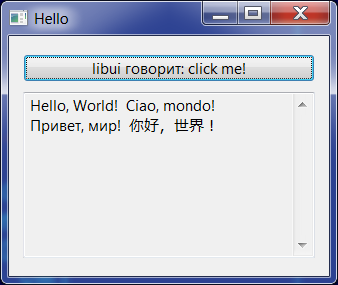
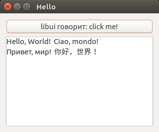
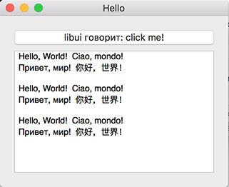

kotlin-libui
============

[Kotlin/Native](https://github.com/JetBrains/kotlin-native) bindings to the
[libui](https://github.com/andlabs/libui.git) C library.

[](https://travis-ci.org/msink/kotlin-libui)
[](https://ci.appveyor.com/project/msink/kotlin-libui)

libui is a C lightweight multi-platform UI library using native widgets on Linux (Gtk3), macOS, and Windows.
Using this bindings you can develop cross-platform but native-looking GUI programs, written in Kotlin,
and compiled to small native executable file.

Cross-platform build is automated using [Travis](https://travis-ci.org) for Linux and macOS targets, and
[AppVeyor](https://ci.appveyor.com) for Windows targets. Just create release on GitHub, and executable files
for all 3 major desktop platforms will be compiled and attached to release.

For local build use `.\build.sh` on Linux or macOS, or `build.bat` on Windows.
In this case only one - native for your platform - file will be built.

## Hello World

Let's start from minimal sample application - single button and single scrollable text area.







C implementation:
``` c
#include "ui.h"

static int onClosing(uiWindow *window, void *data)
{
    uiQuit();
    return 1;
}

static void saySomething(uiButton *button, void *data)
{
    uiMultilineEntryAppend(uiMultilineEntry(data),
        "Hello, World!  Ciao, mondo!\n"
        "Привет, мир!  你好，世界！\n\n");
}

int main(void)
{
    uiInitOptions options;
    uiWindow *window;
    uiBox *box;
    uiButton *button;
    uiMultilineEntry *scroll;

    memset(&options, 0, sizeof(options));
    if (uiInit(&options) != NULL)
        abort();

    window = uiNewWindow("Hello", 320, 240, 0);
    uiWindowSetMargined(window, 1);

    box = uiNewVerticalBox();
    uiBoxSetPadded(box, 1);
    uiWindowSetChild(window, uiControl(box));

    scroll = uiNewMultilineEntry();
    uiMultilineEntrySetReadOnly(scroll, 1);

    button = uiNewButton("libui говорит: click me!");
    uiButtonOnClicked(button, saySomething, scroll);
    uiBoxAppend(box, uiControl(button), 0);

    uiBoxAppend(box, uiControl(scroll), 1);

    uiWindowOnClosing(window, onClosing, NULL);
    uiControlShow(uiControl(window));
    uiMain();
    return 0;
}
```

Direct translation to Kotlin:
``` kotlin
import kotlinx.cinterop.*
import libui.*

fun main(args: Array<String>) = memScoped {
    val options = alloc<uiInitOptions>()
    val error = uiInit(options.ptr)
    if (error != null) throw Error("Error: '${error.toKString()}'")

    val window = uiNewWindow("Hello", 320, 240, 0)
    uiWindowSetMargined(window, 1)

    val box = uiNewVerticalBox()
    uiBoxSetPadded(box, 1)
    uiWindowSetChild(window, box?.reinterpret())

    val scroll = uiNewMultilineEntry()
    uiMultilineEntrySetReadOnly(scroll, 1)
    val button = uiNewButton("libui говорит: click me!")
    fun saySomething(box: CPointer<uiButton>?, scroll: COpaquePointer?) {
        uiMultilineEntryAppend(scroll?.reinterpret(),
            "Hello, World!  Ciao, mondo!\n" +
            "Привет, мир!  你好，世界！\n\n")
    }
    uiButtonOnClicked(button, staticCFunction(::saySomething), scroll)
    uiBoxAppend(box, button?.reinterpret(), 0)
    uiBoxAppend(box, scroll?.reinterpret(), 1)

    fun onClosing(window: CPointer<uiWindow>?, data: COpaquePointer?): Int {
        uiQuit()
        return 1
    }
    uiWindowOnClosing(window, staticCFunction(::onClosing), null)
    uiControlShow(window?.reinterpret())
    uiMain()
    uiUninit()
}
```

While this works, it's far from ideomatic Kotlin.
A little improved:

```
import kotlinx.cinterop.*
import libui.*

fun main(args: Array<String>) = memScoped {
    val options = alloc<uiInitOptions>()
    val error = uiInit(options.ptr)
    if (error != null) throw Error("Error: '${error.toKString()}'")

    val window = Window(
        title = "Hello",
        width = 320,
        height = 240,
        hasMenubar = false).apply {
        margined = true
    }

    val box = VerticalBox().apply {
        padded = true
    }
    uiWindowSetChild(window, box.reinterpret())

    val scroll = MultilineEntry().apply {
        readOnly = true
    }
    val button = Button(
        text = "libui говорит: click me!"
    )
    fun saySomething(box: Button?, scroll: COpaquePointer?) {
        uiMultilineEntryAppend(scroll?.reinterpret(),
            "Hello, World!  Ciao, mondo!\n" +
            "Привет, мир!  你好，世界！\n\n")
    }
    uiButtonOnClicked(button, staticCFunction(::saySomething), scroll)
    uiBoxAppend(box, button.reinterpret(), 0)
    uiBoxAppend(box, scroll.reinterpret(), 1)

    fun onClosing(window: Window?, data: COpaquePointer?): Int {
        uiQuit()
        return 1
    }
    uiWindowOnClosing(window, staticCFunction(::onClosing), null)
    uiControlShow(window.reinterpret())
    uiMain()
    uiUninit()
}
```

**Work in progress!**

There still is wide area for kotlinization.

If anyone have ideas how to make this more ideomatic - Issues and PullRequests are wellcome.
