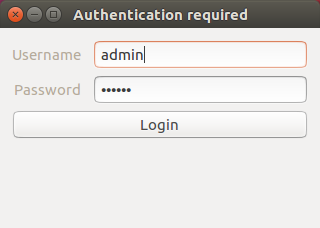

# Form

The sample shows a basic login window. It has a field for username with plain text and one for password with masked task that hides the content. Also there is a button with `Login` text.

| Platform | Preview |
| :--: | :--: |
| Linux | 
